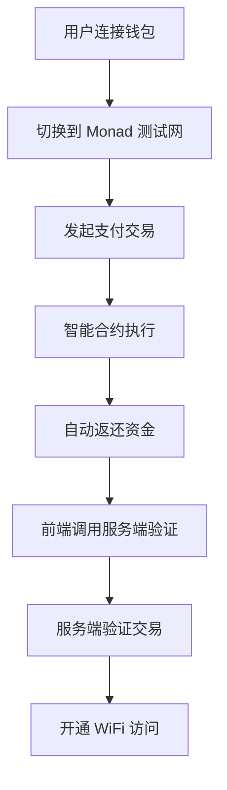

# Monad WiFi Simple - Web3 认证支付应用

基于 Monad 测试网的 DePIN WiFi 认证支付系统，用户通过支付获得 WiFi 访问权限，并自动返还部分资金。

## 🚀 项目特点

- **🌐 Web3 认证**: 基于智能合约的去中心化 WiFi 认证
- **💰 即时返还**: 支付后立即返还 80% 资金，展示 DePIN 经济模型
- **⚡ 高性能**: 利用 Monad 测试网的高 TPS 和快速确认
- **📱 移动优先**: 响应式设计，完美适配手机端
- **🔒 安全可靠**: 智能合约保障资金安全，服务端双重验证

## 🛠 技术栈

### 前端
- **Vue 3** + **TypeScript** - 现代化前端框架
- **Element UI Plus** - 优雅的 UI 组件库
- **Ethers.js** - Web3 区块链交互
- **Vite** - 快速构建工具

### 区块链
- **Monad Testnet** - 高性能 EVM 兼容链
- **Solidity** - 智能合约开发
- **Hardhat** - 合约开发和部署工具

## 🏗 项目结构

```
monadwifi-simple/
├── src/
│   ├── components/          # Vue 组件
│   ├── composables/         # Vue 组合式函数
│   │   ├── useWallet.ts    # 钱包连接逻辑
│   │   └── usePayment.ts   # 支付处理逻辑
│   ├── types/              # TypeScript 类型定义
│   ├── App.vue             # 主应用组件
│   └── main.ts             # 应用入口
├── contracts/
│   └── PayAndReturnContract.sol  # 支付返还智能合约
├── scripts/
│   └── deploy.js           # 合约部署脚本
├── hardhat.config.js       # Hardhat 配置
└── package.json
```

## 🚦 快速开始

### 1. 环境准备

```bash
# 克隆项目
git clone <repository-url>
cd monadwifi-simple

# 安装依赖
npm install

# 安装 Hardhat (用于合约部署)
npm install --save-dev hardhat @nomicfoundation/hardhat-toolbox
```

### 2. 配置环境变量

```bash
# 复制环境变量模板
cp .env.example .env

# 编辑 .env 文件，填入你的私钥
PRIVATE_KEY=your_private_key_here
```

### 3. 部署智能合约

```bash
# 编译合约
npm run compile

# 部署到 Monad 测试网 (需要测试代币)
npm run deploy:monad

# 或者先在本地测试
npm run deploy:local
```

⚠️ **重要**: 部署到Monad测试网需要先获取测试代币
- 访问Monad测试网水龙头获取tMON
- 确保账户至少有0.1 tMON用于Gas费用

部署成功后，系统会自动生成前端配置代码。

### 4. 启动前端应用

```bash
# 开发模式
npm run dev

# 构建生产版本
npm run build
```

### 5. 配置 MetaMask

添加 Monad 测试网到 MetaMask：

- **网络名称**: Monad Testnet
- **RPC URL**: https://testnet-rpc.monad.xyz
- **链 ID**: 10143
- **货币符号**: MON
- **区块浏览器**: https://testnet-explorer.monad.xyz

## 💡 使用流程

### 用户端操作

1. **连接钱包** - 点击"连接钱包"按钮，授权 MetaMask
2. **确认网络** - 自动切换到 Monad 测试网
3. **发起支付** - 点击"支付并返还"按钮
4. **确认交易** - 在 MetaMask 中确认支付交易
5. **获得返还** - 自动收到 80% 资金返还
6. **WiFi 解锁** - 服务端验证后开通网络访问

### 技术流程



## 🔧 核心功能

### 智能合约功能

- `payAndReturn()` - 支付并自动返还资金
- `getUserStats()` - 获取用户支付统计
- `getContractStats()` - 获取合约统计信息
- 自动事件记录和资金管理

### 前端功能

- 自动检测和连接 MetaMask
- 自动切换到 Monad 测试网
- 实时余额显示
- 交易状态跟踪
- 错误处理和用户提示

### 服务端集成

POST 接口示例：
```javascript
// 请求
POST /api/verify-payment
{
  "txHash": "0x...",
  "userAddress": "0x...",
  "paidAmount": 1.0,
  "returnedAmount": 0.8
}

// 响应
{
  "success": true,
  "message": "Payment verified",
  "allowAccess": true
}
```

## 🎨 界面设计

- **渐变背景** - 现代化视觉效果
- **圆形 Logo** - 品牌标识设计
- **卡片布局** - 清晰的信息层次
- **状态反馈** - 实时操作状态显示
- **响应式设计** - 完美适配移动设备

## 🔍 开发调试

### 本地测试

```bash
# 启动本地 Hardhat 网络
npx hardhat node

# 部署到本地网络
npx hardhat run scripts/deploy.js --network localhost
```

### 合约测试

```bash
# 运行合约测试
npx hardhat test

# 查看 Gas 报告
REPORT_GAS=true npx hardhat test
```

### 前端调试

- 开启浏览器开发者工具
- 查看 Console 日志
- 监控 Network 请求
- 检查 MetaMask 交易状态

## 🚨 注意事项

1. **私钥安全** - 绝不要将私钥提交到代码仓库
2. **测试网络** - 仅在测试网络使用，避免主网资金损失
3. **Gas 费用** - 确保账户有足够的 tMON 支付 Gas 费
4. **网络稳定性** - 测试网可能不稳定，注意异常处理

## 🤝 贡献指南

1. Fork 项目
2. 创建功能分支 (`git checkout -b feature/AmazingFeature`)
3. 提交更改 (`git commit -m 'Add some AmazingFeature'`)
4. 推送到分支 (`git push origin feature/AmazingFeature`)
5. 创建 Pull Request

## 📄 许可证

本项目采用 MIT 许可证 - 查看 [LICENSE](LICENSE) 文件了解详情。

## 🎯 适用场景

- **DePIN WiFi 热点** - 去中心化 WiFi 基础设施
- **Hackathon 演示** - 展示 Web3 + DePIN 结合
- **教育项目** - 学习智能合约和 DApp 开发
- **概念验证** - 区块链支付系统原型

## 📞 支持

如有问题或建议，请：
- 创建 GitHub Issue
- 发送邮件至项目维护者
- 参与社区讨论

---

**🚀 体验 Monad 的高性能和 DePIN 的无限可能！**